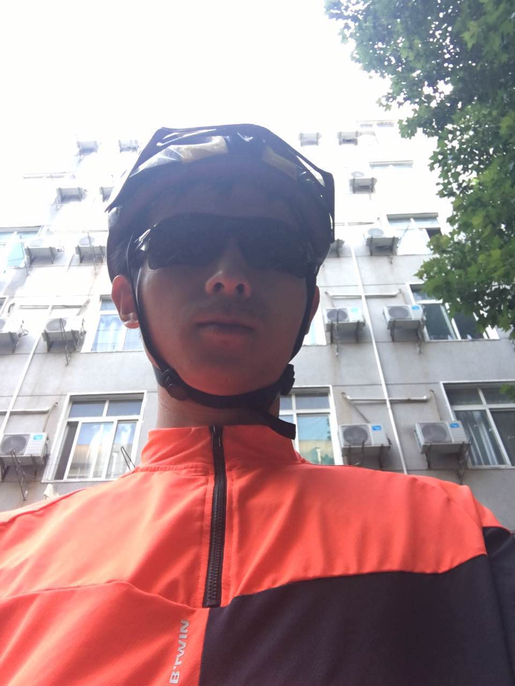

# 卢威(Wei Lu)

I'm Wei Lu. I received a Bachelor degree and a Ph.D in GIS from Wuhan University in the years 2012 and 2021. My academic background is primarily in Cartography and Geographical Information Science, especially in geometry algorithms and geovisualization. Now, I foucus on Topological Data Analysis(TDA) with geospatial data and topics. I like reading, running, and cycling. I have completed marathon race, and my PB is 4h 11m. I have made a bike travel along the hu-line, from Tengchong, Yunan to Heihe, Heilongjiang in 2020. This is the travel map: <a href="http://huline.xyz/">http://huline.xyz/</a> 

我是卢威。我分别在2012年和2021年从武汉大学获得GIS领域的理学学士学位和工学博士学位。我的学术背景主要在地图学和地理信息科学领域，尤其是几何算法和地理可视化。当前，我主要专注于面向地理空间数据的拓扑数据分析（TDA）理论和方法的研究，即利用代数拓扑的理论方法研究空间大数据问题。个人爱好阅读、跑步和骑行。曾参加过三次马拉松比赛，并完赛，最好成绩4小时11分。曾在2020年暑假期间，历时60日，完成沿胡焕庸线的长途骑行，从云南腾冲到黑龙江黑河，全程5800余公里。  

My Résumé(简历): <a href="pages/resume.en.html">EN</a> &sdot;<a href="pages/resume.zh.html">中文</a>&sdot; <a href="static/resume.luwei.zh.cn.pdf">PDF.CN</a>

## Contact
* **Email**: whuluwei at gmail.com; whuluwei at whu.edu.cn

## Research
Some of my papers: [Google Scholar](https://scholar.google.com/citations?user=q8gtz8AAAAAJ) 

## News
* 2021-08-16, I am a dad now!
* 2021-05-23, I defensed my doctor thesis.
* 2020-09-04, I completed a long bike travel alone the hu-line: <a href="http://huline.xyz/">http://huline.xyz/</a>

## Writings
* [骑胡线——自行车穿行中国之旅（更新7月5日）](pages/hulineride.html)
* [我的马拉松记事](pages/mymarathon.html)