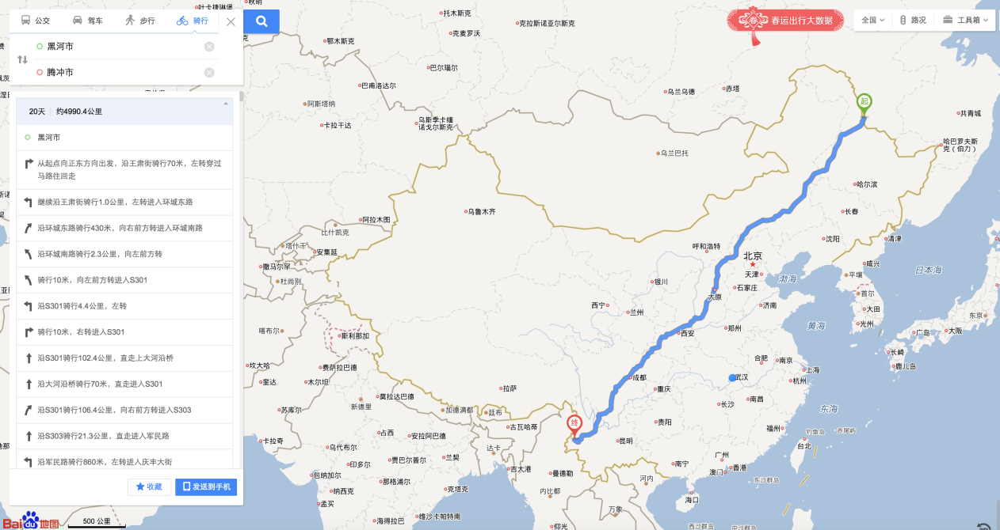
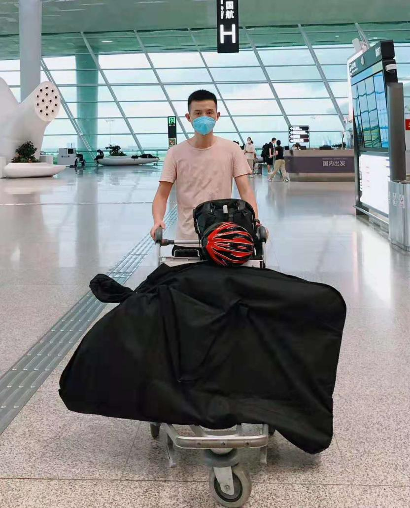

# 骑胡线——自行车穿行中国之旅
## 1 缘起与准备
这趟单车骑行计划，是一个在蕴藏在心里又好几年的想法。我是一个骑行的爱好者，但并不是一个狂热爱好者，喜欢偶尔独自一人骑行穿行在城市中，不想什么，偶尔抬头看看风景，感受骑行的速度感。骑行胡焕庸人口密度分布线，是一个偶然萌发的想法，或许是看到很多人骑行川藏线，激发我也想一个特别但也很有意义的线路。一条直线连接中国西南到东北的两个城市，腾冲和黑河，当然无法走真正的直线，这条线只是真实骑行线路的一个指引方向，左右穿插。2019年末，一次没有预兆的大流行瘟疫爆发，而在这关键节点我也结婚了，同时博士学业一直在内耗对抗，无法画上句号，很多事情堆在身上，出现了中度抑郁的倾向，就开始和爱人商量着希望去践行我的骑行想法，她表示非常支持。就在在瘟疫有所好转的时候，毅然决然将计划付诸实施，单人单车，从南到北，行路万里。
### 1.1 缘起
作为一个地理信息行业的从业者，每天都是与地理数据打交道，喜欢看地图，看数据，分析数据。通过地形图，可以看出山川形态走势。而这些始终是那么的抽象，内心总是渴望着到实地一探究竟。具体也记不清是什么时候，大概是三四年之前，突然萌发了一个想法，骑行走一趟胡焕庸线，也就是人口分布线，从黑河到腾冲。当时也就突然奇想，但是就埋下了种子，是不是那个想法会从脑子里冒出来。终于在2020年这特殊的一年，这件事情决定去做了。

图1.1 百度地图黑河到腾冲骑行线路

2020年是不平凡的一年，对我个人来说，也是非常重要的一年。在年初，赶在瘟疫爆发前夕，我举办了婚礼，然后和爱人一起来到了深圳，然后就是瘟疫大爆发，无法返回老家过年。在瘟疫期间，基本上时禁足状态，时刻通过各种渠道了解武汉的疫情状况，也尽我所能帮助联系医疗资源。这个过程中，看到不少令人伤心，心痛的社会事件，一时之间对自己生活的这个世界产生了极大的怀疑，对自己也产生极大的怀疑，出现了严重的心理问题。不知道该何去何从。

也就是在这样的一种情况下，那个想法又开始在我脑子里蔓延，我向我爱人诉说我的想法，没想到她非常支持我出门走上一走。因为我自己是一个很静的人，平时不喜欢到处跑动，她非常赞成我能有这样的一个机会和勇气独自走出去，唯一的前提是时刻保持警惕和细心，一切以安全为第一要素。我答应她，接着就是作出行的准备。

### 1.2 准备
为了这次行程顺利进行，我主要从线路、装备以及身体锻炼三个方面做充分的准备。
首先是线路图。从黑河到腾冲，从中国的东北到西南，是一个很长的距离，地形地貌宽度也非常的大。首先确定的是从北到南还是从南到北，最开始想法是从东北往南走，后面因为北方疫情有所反复，选择从南方往北方走。然后就是线路准备，首先通过直线连接黑河和腾讯两个城市，在这条直线两旁寻找待落脚的县级及以上的城市，经历保持两个城市点之间的距离在100-200公里左右，也就是保证每天能够从一个城市到达另一个城市，骑行的线路选择国道和省道。这样就做了一个初步的线路筛选，并通过骑行软件做了路书。大概需要骑行43段线路，预计历时2个月。最后骑行过程中发现，基本线路差不多，但是基本上还是没到一段会重新规划下一段时间的线路，会有较多的调整。

其次是装备的选择。第一要素当然是自行车，由于是一段长途旅行，就没有选择平时使用的山地车，选择了一辆钢架结构的旅行车，主要觉得钢架结构牢靠，另外钢架车弹性好，长途骑行的舒适度比较高。然后就是骑行的配件，头盔，锁鞋，锁踏和常规脚踏。计划着轻装出行，就没有配备货架，用了背包和一个大的后尾包。最后证明这是错误的选择，沿路出故障换装备。然后准备了基本的修车装备，主要是打气筒，补胎套件，备用内胎。最后就是各种衣物和救生装备，压缩饼干和救生毯。通讯设备额外准备了一个续航长的诺基亚手机，还准备了一台二手的ThinkPad X230笔记本，以及一个20000毫安时的移动电源。最后就是一些防晒防护用品，防晒霜，皮肤衣，冰袖等。

最后，其实也是最为重要的就是身体条件，比较这种骑行并不是一般体能能坚持下来的，所以开始做一些跑步锻炼，手臂力量的练习，保证体能能够跟得上，同时恶劣情况下手臂有力量扶住车把。自己在也有过跑马拉松的经历，体能上对自己还是有一定的信心。

### 1.3 出发
一大早5：30出发去机场，头天晚上预约的司机居然没有来，怕是睡着了。重新叫车，幸好有接单的。出发前，对行李做了分类，自行车拆前后轮，隔离，绑定，与自行车配件等一起；衣物一包；电子产品一个袋子。因此，在托运自行车，过安检相对快速顺利。和老婆在机场一起吃了个早餐，然后去登机口。航班分两段，先到昆明长水机场，然后转机到腾冲驼峰机场，中间因为行李没有直挂，需要在昆明再次办理托运，也都很顺利。出机场的时候，都需要出示云南健康码，绿码放行。在腾冲出来时，检查了身份证，由于武汉身份证，疫情防控的原因，问了行程，也问了核酸检测报告，幸好昨天做过一次检查，出示了电子检测报告，和身份证一起拍照放行。

图1.2 机场出发

航班提前到达了驼峰机场，下飞机立马打电话给酒店接送的司机，不算远，没等多久就上车去酒店。疫情期间，对于我这个武汉身份证也没有过分为难，看了一下健康码，就入住了。进房间第一件事就是解开打包的自行车，开始安装。车包特意贴了易碎标志，还是破了几个小窟窿。自行车装车还是很方便快捷，打气有点问题，气筒不给力，两个轮子折腾了十几分钟。要换！装好车，收拾了一下行李，就出门把车包寄回去。然后在腾冲市里面到处转悠。

腾冲市整体不算大，很快可以走完一个核心区域，也可能是我没走到。整体觉得还是满冷清，店铺还是很多关门，吃饭的店子很多都没有人吃饭，搞得我都不太敢进去找吃的，最后回酒店点了外卖。第一餐就是外卖。腾冲城市街道非常整洁美观，环境优美，接车司机路上告诉我腾冲市文明城市啥的。城市酒店非常的多，后天就要高考了，一些大的酒店，名字好的住了好些高考的考试，傍晚成群的出来，也可能市刚吃完饭，到小商店买些零食饮料，看起来大家都很开心放松，或许是快要解放的感觉。一时有点恍惚，后来才反应过来这又是一项因疫情影响的规律性的事情，被推迟一个月，仿佛回到了若干年前的高考时间。

图1.3 腾冲市自然与资源局

回酒店吃了饭，准确是吃了两口，和家里通话视频，告知爸妈我的计划。不用想，不同意！让我回去。然后就是老婆和我弟轮番的劝说，我也和老爸仔细讲了我的情况，才勉强同意，也就是你自己决定的事情自己管，现在爸妈是管不了了。实话，都三十的人了，都成家了，我和老婆商量好，大概就行了。不过通话过程中感觉到父亲反应开始有点迟钝，对我坚定的信念还是有一点动摇。而我弟告诉我，骑行就好好骑行，别想其他，完了回来再把事情安顿好就行。是，我既然决定了这一程，那就心首先要定，走完自己选择的这一程路。

和家里谈判完毕，饭菜已经凉了。也不想吃了，打包行李，洗澡休息，准备一早出发。

图1.3 装备装配完毕定妆照

## 2 骑行第1日：腾冲市->怒江大桥（7月6日）

骑胡线第1日骑行线路数据概况

今天是骑行的第一天，计划是从腾冲到保山，而我远远没有意识到云南的山区道路是多么难骑行，路书上的高度图也欺骗了我，最后把行程截断，到怒江大桥口就停下住店。

腾冲这边天黑大概8-9点，早上也就是天亮得稍微晚些，所以8点多才从酒店出发。在市里走了一小段，感受了一下锁鞋的上锁解锁，试试变速的调整，刹车的情况。不一会遇到一个早餐店，进去要了碗牛肉面，没吃几口，感觉要拉肚子，跑厕所。回来，换了碗粥和油条，又没吃几口，又跑厕所。实在是出师不利啊！最后胡乱多吃了几口粥就出发了。当然这估计是神经紧张的缘故，并非闹肚子。

出发一开始便是个长的缓下坡，感觉还行，大概十公里处一个宽阔地带准备停车休息，不小心左脚锁鞋解锁出问题，直接横摔在路上，人没事，可是前面挂的包带子断了，加固的时候固定带子的扣子也飞出去了找不着。这下麻烦，先胡乱绑定这继续走。第一次使用锁鞋，摔车也是必然要经历的，但是锁鞋的好处是便于发力，对膝盖的保护也是较好的，那就继续适应，多加小心便是。

没想到摔车这个地方是个分割点，稍微修正整理行李包之后，就开始漫长的爬坡。体能并没有立马对这样的爬坡做好准备，外加上出门前的聚餐酒喝大了，也伤了点元气，导致这个爬坡太难受了，实在爬不动就开始推车走。沿路碰到道路养护的工人们，都一种似笑非笑的眼神看着我经过，大概是说这傻小子，山路可难爬了。我也是在想不通为啥这么长的坡，明明路书地图显示的坡度看起来挺缓和的，我还是打开手机下载了制作路书的APP，重新手机上看了一下路书高度图，这下傻眼了，今天设计的这一段是2-HC-HC-1级别坡度的连环爬坡，与网页上看到的太不相同了。这可一天搞不定。最后选择在第一个HC后下坡到坡底的怒江大桥口的招待所住下。坡度分级是环法里面对道路坡度的难度的定级，最高级为HC级，也就是所谓的无法定级的坡，1级坡难度都非常大了，今天这设计的线路毫不逊色一个环法的高山赛段。我知道，今天估计只能走一半的路程，沿路停歇休息的时候就看看地图，最后选择在第一个HC级坡下坡坡底的位置停歇，那里是个镇，查询之后发现有宾馆住宿。

第一个坡过来下坡就是一个镇，叫做芒棒，想着估计是芒果多，到了才知道还真是，满地都是卖芒果的，一个车上好像是叫喊着10元四件，我想也太便宜了吧。可是我没地方拿。最后找了家商店，买了饮料，吃了些压缩饼干。这里都是路边摊，想到早上的上厕所，不太敢吃。稍微在店门口休息了一会，又补了两瓶水，开始出发，向第二个坡进发。

沿途都在山林里面，两面都是树林，有太阳也晒不到，所以第一天身体皮肤没有什么反应。沿途偶尔会下下雨，稍微躲一躲就行，几分钟就停。整个途中没有遇到一辆自行车，全部是机动车。遇到一位从临沧过来的大哥，骑摩托车带着老婆去腾冲找事情干，在路边休息，聊了会天，吃了颗他的李子。很快我就继续赶路了，对，就是推车走，爬不动。沿路遇到一对修桥的工程队，他们笑着看着我，大概是在说，这傻小子，累吧。对，确实很累。最有意思的是一位大爷，开这个三轮，走一阵停一阵，遇到我就和我说几句我听不懂的方言，大概也是说这山很难骑车。最后在HC坡快到坡顶时，我直接开口说能载我一程到坡口吗？他欣然同意了，直接载我到坡口，大概两公里路，放我下来，说下坡轻巧些，你先走，方言我大概听明白了。谢过之后我就下坡走，他后面一下子就把我超了。不过后来我又看到他的三轮停在路边，但是人不知去哪里。我就一直下坡到底，后面也没再遇到他，估计是其他路去其他地方了。

下坡到了一个镇，白花镇，又是非常非常多的芒果，沿路都是芒果树，芒果都用纸袋子包着。继续下一小段就到了怒江大桥口，找招待所住下后就去吃饭。店家是老板娘和她女儿。他们在清理冰箱，说是停了一天的电。我说，着肉菜不会坏了吧。她们说没事，都是冰。我也就是一笑，实在是太累了。点了个那叫炒牛肉，配米饭，要了瓶冰镇啤酒。菜是小姑娘炒的，回过来老板娘看了一眼我吃的，不知道说了句啥，好像是抱歉女儿没做好，我说还可以。大家都笑了笑。我只是饿了。一会老板娘女儿从外面回来，洗了一小碟葡萄给我，说送我吃的，自己种的。吃了吃感觉还不错酸酸甜甜的。最后又送了我两个小芒果。吃完饭回招待所登记信息，老板娘看我拿着芒果，说我给你一个好吃的芒果，然后去屋子里拿了一个超大的芒果出来给我，感觉怕有两斤重了。她说他们也做网上生意，今天寄出去了一单，10斤69包邮。后来吃了大芒果，确实香甜。那小芒果是有点偏脆的，也蛮好吃。

很累的一天，好好睡一觉，明日继续出发。

## 3 骑行第2日：怒江大桥 -> 保山市（7月7日）
骑胡线第2日骑行线路数据概况

今天从怒江大桥到保山市全程66公里，一个HC坡，一个1级坡，爬升1500米左右。

刚准备上怒江大桥，被边检拦住盘问一番，从哪里来，哪里人，干什么，摸了摸包，按了按包，放行。过桥基本上就开始爬坡，不过没想到这个HC的坡还是能爬，没有昨天那么难，可能是坡缓一点。这次是盘山路，比较光秃，没什么树林遮挡，没有做好防晒，给晒伤了些。

沿途店子很少，都在山上盘旋而行，眼看着一辆车从自己身边经过，一会就到了自己的头顶，心理的压力还是非常大。第一个坡路上遇到一个人家，买了两瓶水，坐着休息，他们正在吃饭，邀请我一起吃饭，我谢绝了。吃了点压缩饼干，就继续出发。

一路慢慢悠悠骑行。可到了第二个坡，完全不是那么回事，坡太陡峭了，完全骑不动，又是开始大段大段的推车走。而且路也显得窄了些，每次大货车经过我都停下来站到路边去。这次估计有误，没有在山脚下补充水。上山好不容易找到一个人家，没有水卖，也不愿意搭理我，我就走了。最后渴得不行，大概5公里到山顶的时候，决定搭个顺风车，招了几次手，终于有两个大哥开着皮卡停了下来，说明情况，我就放车到后面，上车了，又坐了一段车，到坡顶，下车谢过之后，一路下坡到保山市。

晚上吃一个大餐，几天第一次正儿八经的吃个饭，一斤羊肉，一盘馒头，一瓶啤酒，吃饱休息，第二天修正，改造车子。

8日在保山市停留一天，随处走走逛逛，主要改造车子，首先找了车行装了一个货架，没有钢架，只有铝架，按照重量也足够用了，还有就是驮包，居然找了好多车行都没有找到，最后在一个车行找到了一个，居然扣子一捏就断了。最终在一个偏远的车行找到了一个勉强够用的。回客栈装好东西，好像勉强都能装完，用裁开的车内胎绑定还算稳固。然后又去车行买了一个水袋包，顺便把出行的尾包和背包都寄回去了。

骑行在路上，本质上是怎么方便怎么来，而不是要帅气好看。

## 4 骑行第3日：保山市——永平县（7月8日）

今天出发从保山道永平县，修整一日，加上前两天的适应期，今天的爬坡还是可以爬得动，推车少了很多，大部分时间都是慢速骑行上去的。

上完第一个坡之后路过一个镇子，在路口吃了饭，毕竟后面还有一个大坡需要爬。点了份毛豆米炒火腿肉，有点咸了。得亏和店家讲了价钱，肉可以少放点，少10元钱，不然也吃不下那么多咸肉啊。店家有几坛子酒，问了是米酒，度数不高，不过还是不敢酒驾，就没有要上一杯。吃饱休息了一会，灌了一壶水就出发了。

下坡一小段后就是沿着澜沧江走，然后过永保桥后沿着盘山公路上山，在山腰有个路边刚好有个口子，就停车过去看看，俯瞰澜沧江，甚是壮观。一个感想，看似慢条斯理，实则蕴千万之力。

进入永平之后，就在博南镇住下，环境还不错。博南算是新区，也是永平的经济中心，不过整体看仍然人气不足。很多家具设备店。因为沿路看到过永平黄焖鸡，就找了附近评价最好的一家，过去要了一个单人套餐，分量还不错，一份鸡，一份豌豆苗豆腐汤，一罐柠檬汁，一碟瓜子，吃的满足。